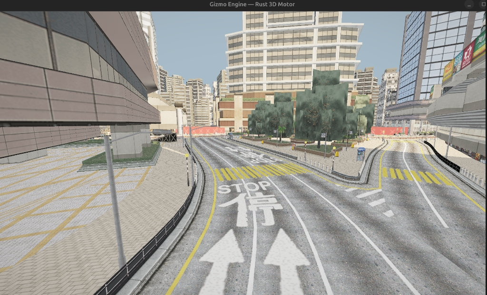
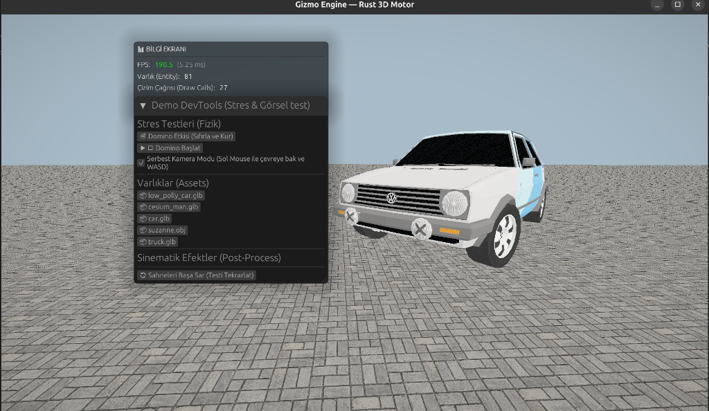
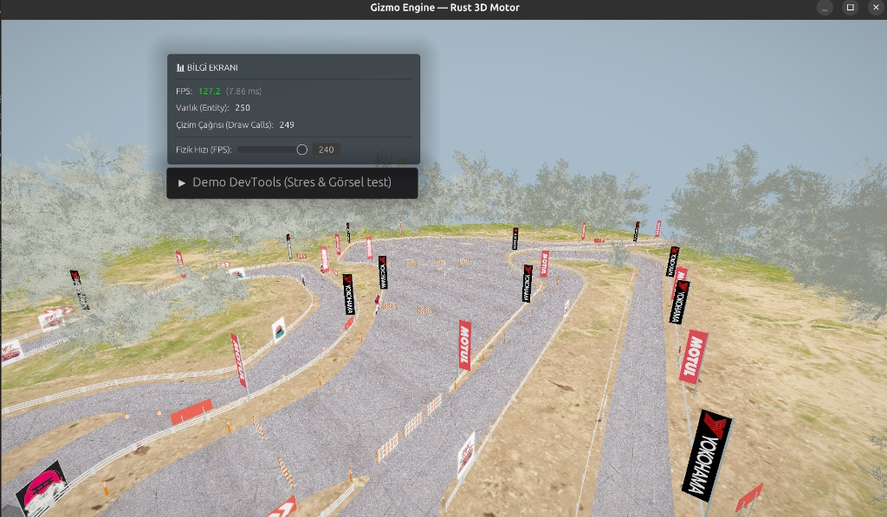

# Gizmo Engine

<div align="center">
  
</div>

Gizmo Engine, Rust programlama dili kullanılarak sıfırdan geliştirilen; yüksek performanslı, veri odaklı (Data-Driven) ve tamamıyla modüler bir **3D Oyun Motoru ve Fizik Simülasyonu** çatısıdır. Gizmo Engine, performansın kritik olduğu geniş ölçekli fizik simülasyonları, modern araç içi dinamikleri ve gelişmiş 3D Rendering işlemleri için özel olarak inşa edilmiştir.

## 🚀 Motorun Yetenekleri (Neler Yapabilir?)

Gizmo Engine salt bir görüntüleyici olmanın ötesinde endüstri standardı özellikler sunan tam teşekküllü bir sistemdir. Motorun temel bileşenleri ve öne çıkan kabiliyetleri şunlardır:

### 🧩 Pürüzsüz ECS (Entity Component System)
Motorun kalbinde, tüm nesnelerin ve mantıksal sistemlerin ayrıştırıldığı hafıza-dostu bir ECS mimarisi yatar. Bellek ve `RefCell` yükleri minimuma indirilmiş yapı sayesinde on binlerce "entity" darboğaz yaşanmadan aynı anda güncellenebilir.

### 🌌 Vektörel Gizmo Fizik Motoru
Üçüncü parti bir fizik API'si (Jolt, Rapier vb.) kullanılmadan **tamamen matematiksel vektör hesabı** ile inşa edilmiş, multi-body yapılar için destek sunan özel fizik çözücüsü:
* **Sweep and Prune (3D Broad-Phase):** 10.000'den fazla hareket eden nesne arasındaki olası çarpışmaları bulmak için Rayon destekli Çoklu-iş parçacığı (Multi-thread) kaba eleme algoritması.
* **Narrow-Phase & GJK/EPA:** Karmaşık poligon, küre (sphere), kapsül (capsule) ve Convex Hull geometriler için kusursuz temas (contact) ve penetrasyon hesaplamaları.
* **Angular Jacobian Solver:** Eklemlerde (Ball-Socket, Hinge) açısal ivme ve tork üzerinden sequential impulse (iteratif vuruş) uygulayan pürüzsüz joint mekaniği.
* **Coulomb Sürtünme & Moment of Inertia:** Gerçekçi statik/dinamik sürtünme modellerine sahip, nesnenin atalet (eylemsizlik) momentini dikkate alan kusursuz fizik iterasyonları.

### 🏎️ Component Tabanlı Araç (Vehicle) Fiziği
Araçlara özel Raycast-tabanlı spring-damper süspansiyon sistemi. Anti-roll bar hesaplamaları, drift (yanlama) fizikleri için kayma ve tutunma grafikleri ve bağımsız FWD (Önden Çekiş), RWD (Arkadan İtiş) veya 4WD (Dört Çeker) tork asistanı ile çok esnek bir araç simülasyon dinamiği.

### 🎨 GPU Instancing & PBR Rendering
Vulkan/WGSL altyapısı sayesinde devasa sahneleri belleğe tek seferde kopyalayıp "Tek Draw Call" ile yüksek ekran yenileme hızında çizen instanced rendering mimarisi.
* **GLTF PBR Material Desteği:** Albedo, Normal Map, Metallic ve Roughness haritalarını otomatik harmanlayan, real-time ışıklandırmalı modern shader algoritmaları.
* **Dynamic Shadows & Post-Processing:** Gerçek zamanlı yönlü ışık gölgeleri, Bloom parlaması, HDR ton haritalama (Tone Mapping) ve Vignette gibi atmosferik iyileştirmeler.
* **Particle System & FX:** Karakterler veya drift dumanları gibi parçacık efektlerini draw-call yaratmadan üreten sistemler.

### 🎧 3D Uzamsal (Spatial) Ses Motoru
Karakterlerin veya motor seslerinin, ana kameraya veya oyuncuya olan uzaklığına/yakınlığına göre şiddeti azalıp artan, objenin yönüne bağlı panoramik (Örn: Motor solda çalışıyorsa sol kulaklıktan gelmesi) ortam üreten RAM-cache optimizasyonlu sistem. Doppler efekti ve mesafe zayıflatması (Distance Attenuation) desteki.

### 🛠️ Gelişmiş Editör ve Workflow
Sahneyi gerçek zamanlı denetlemek için oyuna gömülü (In-Game) çalışan UI panelleri:
* Gizli dosyaları ve nesneleri bulabileceğiniz dinamik hierarchy (Entity Ağacı).
* Pozisyon, rotasyon ve özellikleri anlık olarak değiştirebileceğiniz Inspector.
* Sürükle-bırak destekli "Prefab" sistemi ve sahne yönetim hiyerarşisi.

## 📸 Motordan Görüntüler

Motor gücünü test etmek için hazırlanan araç / render senkronizasyon karelerinden bazıları:









## 📚 Dokümantasyon & Teknik Loglar
Motorun çekirdek yapısı sıfırdan geliştirilirken karşılaşılan kernel ve GPU driver düzeyindeki problemleri nasıl teşhis edip, motor seviyesinde nasıl çözdüğümüzü okuyabileceğiniz inceleme logları:
* [📖 Olay İncelemesi: WGSL Mesa `pow(0.0)` Linux Sürücü Hatası ve PBR Render Çökmesi](WGSL_MESA_BUG.md)

## 🎮 Motoru Derlemek ve Çalıştırmak
Sistemin becerilerini test etmek, geniş bir haritada aracı sürmek ve devasa fizik simülasyonunu görmek için:

```bash
cargo run --release --bin demo
```

> **Önemli Not:** Sistem on binlerce objenin fizik ve kaba eleme (Broad-Phase) hesaplamasını tek saniyede çözmek üzerine optimize edildiği için `--release` profili haricinde derlenmesi performans düşüklüğüne (Darboğaz) yol açacaktır! Mutlaka release build kullanın.
