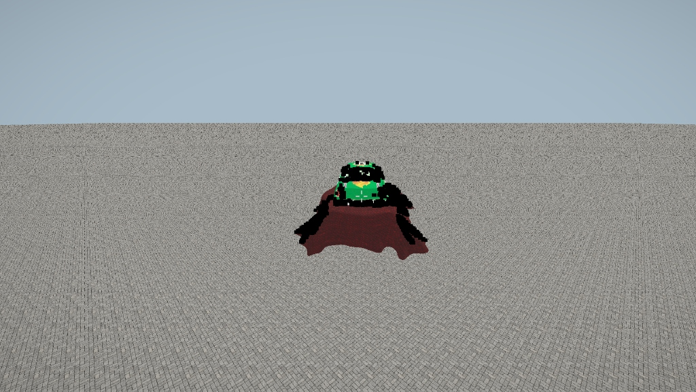

# WGSL Mesa Vulkan Driver `pow(0.0)` NaN Bug

This document details a critical GPU specific bug encountered during the development of Gizmo Engine's Shadow Mapping and PBR rendering pipeline, and its corresponding solution.

## The Symptoms

While rendering a standard GLTF model (`suzanne.obj`, `vw.glb`) using WGPU and WGSL, massive rendering artifacts appeared on screen. Specifically, large portions of the models (roughly 50% of their surface area) rendered **pitch black**, accompanied by heavy polygonal z-fighting and tearing. 

Strangely, materials designated as `unlit` (like vehicle windows and flame decals) rendered flawlessly.

 *(Concept visualization of black polygons disrupting normal rendering)*

## The Investigation

After eliminating common culprits such as:
1. `normalize(0.0)` Division-by-Zero errors on vertex normals.
2. Malformed `in.color` vertex data arrays defaulting to black.
3. Uninitialized matrix or Uniform Buffer Object (UBO) alignments in Rust.
4. Back-Face Culling (`wgpu::Face::Back`) winding order mismatches.

We narrowed the issue down specifically to the **Specular Highlight** calculation inside the lighting loop.

## The Core Problem

In the WGSL fragment shader, the specular component of the Blinn-Phong/PBR lighting equation was calculated as follows:

```wgsl
let diff = max(dot(N, L), 0.0);
var spec = 0.0;

if (diff > 0.0) {
    let reflect_dir = reflect(-L, N);
    // VULNERABLE LINE:
    spec = pow(max(dot(view_dir, reflect_dir), 0.0), shininess);
}
```

Whenever a fragment was facing exactly away from the reflection lobe, the `max` function clamped the dot product to precisely `0.0`. 
Mathematically, `pow(0.0, shininess)` where `shininess > 0.0` should be safely `0.0`.

However, on specific Linux open-source drivers (specifically **Mesa RADV for AMD** and **Intel ANV**), the algebraic translation of the `pow(x, y)` intrinsic is implemented as `exp2(log2(x) * y)`. 
When `x = 0.0`, `log2(0.0)` yields `-Infinity`. The subsequent multiplication with `shininess` creates complex `-Inf * y` scenarios which, rather than clamping to 0, trigger arithmetic instability and return `NaN` (Not a Number).

As soon as `spec` became `NaN`, the entire `final_color` pixel equation (`ambient + diffuse + specular`) was poisoned with `NaN`. WGPU correctly handles `NaN` colors by rendering them as pure black (`#000000`). This completely annihilated half the geometry's shading, leading to the bizarre black flickering artifacts.

## The Solution

The fix is incredibly simple but crucial for cross-platform WGPU interoperability on Linux. We must artificially prevent the base of the `pow()` function from ever reaching absolute zero.

By clamping the minimum base value to a highly trivial number (e.g., `0.0001`), the `log2()` math remains fully stable and the visual output is completely indistinguishable from true zero.

```wgsl
if (diff > 0.0) {
    let reflect_dir = reflect(-L, N);
    // PATCHED LINE: Enforce a minimum base of 0.0001 to prevent log2(0) -Inf NaN cascade 
    spec = pow(max(dot(view_dir, reflect_dir), 0.0001), shininess);
}
```

This ensures the Gizmo Engine's rendering pipeline remains rock solid across all Linux environments, completely bypassing the driver-level math crash.
